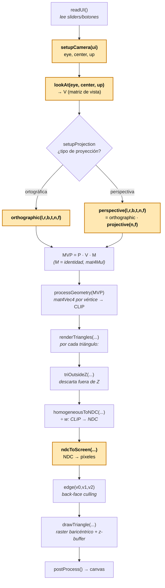

# TP3 — Cámara, transformaciones 3D y proyecciones

App en JavaScript (sin librerías) que dibuja un cubo con un pipeline de render
mínimo: cámara `lookAt`, proyección perspectiva/ortográfica, paso a pantalla y
rasterizado con baricéntricas + *z-buffer*. Tu objetivo es **programar las
transformaciones 3D y la cámara**; el álgebra de vectores/matrices y el
rasterizador ya vienen dados.

## Cómo ejecutarlo

Abrí los `.html` en el navegador (mejor con un servidor local):

```bash
# desde tp3/
python3 -m http.server 8000   # http://localhost:8000/index.html
```

- `index.html` — app interactiva (cámara, proyección, botones fill/depth y perspectiva/ortográfica).
- `test.html` — corre los tests unitarios.

## Qué tenés que hacer

Todas las funciones a completar están en **`ejercicio3.js`**, marcadas con el
comentario **`TODO`**. Son estas seis (todas usan matrices **column-major**):

| Función | Qué construye |
| --- | --- |
| `setupCamera(ui)` | Posición y orientación de la cámara → `{ eye, center, up }` |
| `lookAt(eye, center, up)` | Matriz de **vista** `V` (mundo → cámara) |
| `orthographic(l, r, b, t, n, f)` | Matriz de proyección **ortográfica** |
| `projective(n, f)` | Matriz **proyectiva** (la que "aplasta" el frustum) |
| `perspective(l, r, b, t, n, f)` | Matriz de **perspectiva** = `orthographic · projective` |
| `ndcToScreen(ndc, w, h)` | Transformación de **ventana** (NDC → píxeles) |

**Detalle de cada una:**

- **`setupCamera(ui)`** — Convierte los ángulos de los sliders en la **posición**
  de la cámara. La cámara orbita el origen sobre una esfera de radio fijo
  `radius = 3`, siempre mirando al centro. Devolvé `center = [0,0,0]`,
  `up = [0,1,0]` y calculá `eye` con el acimut `ui.az` y la elevación `ui.el`.

  [](https://github.com/LIA-DiTella/computacion-grafica-soluciones/blob/2c-2025/soluciones/tp3/2-azimut-elevacion.png)

  `az` y `el` son **parámetros de la cámara** (no del objeto). Definen dónde se
  ubica el `eye` sobre la esfera de radio 3:
  - **azimut** `az`: ángulo en el plano horizontal `XZ`, medido desde `+X` hacia
    `+Z`; gira la cámara alrededor del eje vertical `Y` (`az = 0` → cámara sobre `+X`).
  - **elevación** `el`: ángulo desde el plano `XZ` hacia arriba (`+Y`); la sube o
    baja (`el = 0` → a la altura del piso, `el = 90°` → justo encima, en `+Y`).

  > **De la UI a la cámara:** los sliders dan *ángulos* → `setupCamera` los
  > convierte en un *punto* `eye` sobre la esfera → `lookAt(eye, center, up)` arma
  > la *matriz* que lleva el mundo al sistema de la cámara. Los sliders **no rotan
  > el cubo**: mueven la cámara a su alrededor, y `lookAt` la reapunta al centro.

- **`lookAt(eye, center, up)`** — Construye la **matriz de vista** `V` (mundo →
  cámara), como la "Transformación de cámara" de la clase: **`V = R · T`**.
  - `T` traslada por `−eye` (lleva la cámara al origen).
  - `R` tiene por **filas** la base ortonormal de la cámara `u, v, w`:
    - `−w = normalize(center − eye)` — dirección de visión (la cámara mira a `−Z`),
    - `u = normalize((−w) × up)` — lateral (derecha),
    - `v = u × (−w)` — arriba real.
  - Chequeo: cámara en el origen mirando a `−Z` ⇒ `V` es la identidad.

- **`orthographic(l, r, b, t, n, f)`** — Lleva la caja `[l,r]×[b,t]×[n,f]` al cubo
  canónico `[-1,1]³` con una escala + traslación por eje:

  ```
  | 2/(r-l)     0        0      -(r+l)/(r-l) |
  |   0      2/(t-b)     0      -(t+b)/(t-b) |
  |   0         0     2/(n-f)   -(n+f)/(n-f) |
  |   0         0        0            1      |
  ```

- **`projective(n, f)`** — Matriz que "aplasta" el frustum en una caja. La fila
  inferior `[0 0 1 0]` hace que `w' = z` (por eso, al dividir luego por `w`,
  aparece la perspectiva):

  ```
  | n   0     0      0  |
  | 0   n     0      0  |
  | 0   0   n+f   -f·n  |
  | 0   0     1      0  |
  ```

- **`perspective(l, r, b, t, n, f)`** — No la armes a mano: es la **composición**
  `mat4Mul(orthographic(l,r,b,t,n,f), projective(n,f))` (primero proyecta, después
  normaliza al cubo canónico).

- **`ndcToScreen(ndc, w, h)`** — Pasa de NDC a píxeles con la matriz de ventana.
  **Invertí Y** (en pantalla crece hacia abajo) y **conservá z** para el z-buffer:

  ```
  x_pantalla =  (w/2)·x_ndc + (w-1)/2
  y_pantalla = -(h/2)·y_ndc + (h-1)/2
  ```

El resto ya está resuelto y **no hace falta tocarlo** (marcado como `PROVISTA`):
`Vec`, `mat4Mul`, `mat4Vec4`, el *perspective divide* (`homogeneousToNDC`) y el
rasterizador (`edge`, `drawTriangle`). La orquestación del pipeline vive en `tp3.js`.

### Convenciones

- Matrices **column-major** (arreglo de 16 valores).
- La cámara mira hacia **`-Z`**: los planos `n` (near) y `f` (far) son coordenadas
  z **negativas**, con `n > f` (`n - f > 0`).
- **NDC** *(Normalized Device Coordinates)*: `x, y, z ∈ [-1, 1]`.

## El pipeline de renderizado

Cada frame llama a `render()` (en `tp3.js`). Los pasos resaltados son los que
implementás vos; el resto viene provisto.



### Espacios de coordenadas que atraviesa un vértice

```
Modelo ──[ M ]──► Mundo ──[ V = lookAt ]──► Cámara ──[ P = proyección ]──► CLIP
   └─ perspective divide (÷ w) ─► NDC ──[ ndcToScreen ]─► Pantalla (píxeles)
```

## Tests

Abrí `test.html` y ejecutá los tests: `test-ejercicio3.js` prueba cada función y
la integración del pipeline (`MVP → NDC → pantalla`). Se ponen en verde a medida
que completás cada `TODO`.

## Archivos del proyecto

| Archivo | Rol |
| --- | --- |
| `ejercicio3.js` | **Acá trabajás vos.** Funciones a implementar + funciones provistas. |
| `tp3.js` | Orquestación del pipeline (`render`), datos del cubo y utilidades de UI. |
| `world-view.js` | Vista auxiliar "del mundo" que muestra la cámara y el frustum. |
| `index.html` / `style.css` | Interfaz de la aplicación. |
| `test.html` / `test-ejercicio3.js` | Tests unitarios. |
