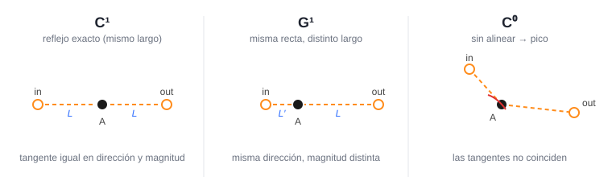

# TP6 — Editor de curvas de Bézier

Aplicación web didáctica para **construir, visualizar y entender curvas de Bézier
cúbicas por trazos** (estilo "pen tool" de Illustrator). Aplica los temas de la
clase *6.0 Curvas*: base de Bernstein, algoritmo de de Casteljau, derivadas /
tangentes, curvatura y continuidad entre trazos.

El **framework ya está resuelto** (interacción, UI y pipeline). Vos tenés que
completar la matemática del "mundo curvas" en [`ejercicio.js`](ejercicio.js),
en los bloques marcados con `[TODO]`.

---

## 1. Cómo se almacenan las curvas

El dibujo es una cadena de **anclas** (`anchors`). Cada ancla tiene una posición
y **dos manijas** (control handles): una de entrada (`in`) y una de salida (`out`).

```text
anchor = { x, y,           // posición del ancla
           inx, iny,       // manija de entrada  (en coordenadas absolutas)
           outx, outy }    // manija de salida
```

Entre dos anclas consecutivas hay **un segmento Bézier cúbico**. Sus 4 puntos de
control se arman así:

```text
p0 = anchor[i]          (posición)         ← extremo, la curva pasa por acá
p1 = anchor[i].out      (manija saliente)
p2 = anchor[i+1].in     (manija entrante)
p3 = anchor[i+1]        (posición)         ← extremo, la curva pasa por acá
```

Guardar el path como *anclas + manijas* (en vez de "puntos de control sueltos")
es lo que permite razonar la **continuidad**: las dos manijas de un mismo ancla
son las que determinan cómo se empalman los dos segmentos que lo comparten.

## 2. Qué hace el shader

La curva **suave** se dibuja con WebGL. La idea clave: en lugar de calcular la
curva en JavaScript y mandar muchos vértices, mandamos **sólo el valor de `t`**
de cada vértice (un buffer con `t = 0, 0.01, …, 1`) y es el **vertex shader** el
que evalúa la posición sobre la curva:

```text
f(t) = (1-t)³ p0 + 3(1-t)² t p1 + 3(1-t) t² p2 + t³ p3
```

Los 4 puntos de control del segmento llegan como `uniforms` (`p0..p3`). Se dibuja
un `LINE_STRIP` por segmento. Vos completás esa fórmula (base de Bernstein)
dentro de `bezierVS`.

## 3. Lógica de visualización por curva

Se combinan dos capas:

- **WebGL (canvas):** sólo la curva suave azul.
- **SVG (overlay):** todo lo interactivo y didáctico —anclas, manijas, polígono
  de control y las visualizaciones sobre el **segmento activo**.

Las visualizaciones didácticas (de Casteljau, tangente, círculo osculador) se
calculan en **JavaScript** usando las mismas funciones que implementás vos,
y se muestran sobre el **segmento activo** (el que empieza en el ancla
seleccionada). Así implementás la matemática una vez y la *ves* dibujada.

El framework, en cada cambio, llama a `redraw()` que:

1. arma la lista de segmentos y se la pasa al shader (`curveDrawer.updatePath`),
2. redibuja el overlay SVG usando `deCasteljau`, `bezierTangent` y
   `bezierCurvature`.

## 4. Curvatura: del círculo osculador a la fórmula que usa el código

En la clase *6.0 Curvas* vimos la interpretación geométrica de la curvatura: cerca
de un punto, una curva puede aproximarse por un **círculo osculador**, es decir,
el círculo que mejor reproduce cómo se está doblando la curva en ese lugar.

Su radio `r` nos dice cuánto se curva:

```text
k = 1 / r
```

Un círculo chico implica una curva muy cerrada (`k` grande). Una recta puede
pensarse como un círculo de radio infinito, por lo que su curvatura es `0`.

El problema es que en una Bézier nosotros no conocemos ese círculo. Lo que
tenemos es una función

```text
f(t) = (x(t), y(t))
```

y queremos obtener el círculo a partir de ella.

### ¿Qué nos dicen las derivadas?

Una forma útil de pensar `t` es imaginar que un punto se mueve sobre la curva.

La primera derivada

```text
f'(t)
```

es su **vector velocidad**: apunta en la dirección tangente a la curva. Su módulo
`|f'(t)|` indica qué tan rápido estamos recorriendo la curva.

La segunda derivada

```text
f''(t)
```

es el cambio de esa velocidad, es decir, una **aceleración**.

Pero la velocidad puede cambiar de dos maneras. Una parte de la aceleración puede
estar en la dirección de la tangente: eso sólo significa que recorremos la curva
más rápido o más lento. La otra parte apunta hacia un costado de la trayectoria:
**esa es la parte que hace que la curva doble**.

Queremos quedarnos sólo con esta segunda componente.

### El producto cruz selecciona el giro

En 2D usamos

```text
f'(t) × f''(t) = x'(t)y''(t) - y'(t)x''(t)
```

Este producto vale `0` si `f''` es paralelo a `f'`. Eso tiene sentido: si la
aceleración sólo apunta hacia adelante o hacia atrás, cambia la rapidez pero la
trayectoria no dobla.

En cambio, cuanto mayor sea la componente de `f''` perpendicular a `f'`, mayor
será `|f' × f''|`. Además, el signo nos dice hacia qué lado gira la curva.

### ¿Por qué aparece `|f'|³`?

Todavía queda un problema: la curvatura no debería depender de qué tan rápido
recorremos la curva. Dos parametrizaciones distintas pueden describir exactamente
la misma forma geométrica pero recorrerla a velocidades diferentes.

Si llamamos

```text
v = |f'(t)|
```

a la rapidez, la componente de la aceleración que apunta hacia el centro del
círculo osculador satisface

```text
a_normal = v² · k
```

Por otro lado, el producto cruz entre velocidad y aceleración mide justamente esa
componente perpendicular, multiplicada por `v`:

```text
|f' × f''| = |f'| · a_normal
            = v · (v² · k)
            = v³ · k
```

Por lo tanto,

```text
         f'(t) × f''(t)
k(t) = -----------------
             |f'(t)|³
```

Ahora se ve de dónde sale la fórmula: el numerador mide cuánto de la aceleración
está haciendo **doblar** la trayectoria, y el denominador elimina el efecto de la
velocidad con la que recorremos la curva.

Si sólo nos interesa el tamaño de la curvatura usamos `|k|`. El radio del círculo
osculador es entonces

```text
r = 1 / |k|
```

### ¿Dónde está el centro del círculo?

El círculo osculador debe tener la misma tangente que la curva. Por eso su centro
tiene que estar sobre la **normal**, es decir, la dirección perpendicular a la
tangente.

Tomamos la tangente `f'(t)`, la giramos 90°, la normalizamos y elegimos el lado
indicado por el signo de `f' × f''`.

Entonces:

```text
centro = f(t) + r · n̂
```

donde `n̂` es la normal unitaria orientada hacia el lado al que está doblando la
curva.

Eso es lo que implementa `bezierCurvature`: calcula `f'(t)` y `f''(t)`, obtiene la
curvatura, calcula `r = 1 / |k|` y coloca el centro del círculo sobre la normal.

Si

```text
f'(t) × f''(t) ≈ 0
```

la curva es localmente recta: `k ≈ 0`, `r → ∞` y no hay un círculo osculador
finito que dibujar.

## 5. Continuidad: por qué se "espejan" las manijas

Un ancla es un punto **compartido por dos segmentos**: es el `p3` del segmento que
termina ahí y el `p0` del que arranca. Sus dos manijas también juegan doble rol:
la de entrada (`in`) es el `p2` del segmento anterior y la de salida (`out`) es el
`p1` del siguiente.

La clave está en la **tangente**: una Bézier, en su extremo, sale en la dirección
que va del ancla hacia su manija (arranca hacia `p1 - p0` y termina llegando desde
`p3 - p2`). Entonces, para que los dos segmentos empalmen sin "pico", las dos
manijas del ancla tienen que estar **alineadas con el ancla y en lados opuestos**.

Por eso, cuando arrastrás una manija, **espejamos la otra respecto del ancla**.
Si pensamos cada manija como un vector que sale del ancla, "espejar" es negar ese
vector (y, según el modo, reescalarlo):

- **C⁰:** no tocamos nada → puede quedar un pico (esquina).
- **C¹:** la opuesta es el reflejo exacto (mismo largo, lado contrario) → la
  tangente coincide en dirección **y** magnitud (empalme perfectamente suave).
- **G¹:** la opuesta va al lado contrario pero conserva **su** largo → coincide la
  dirección de la tangente, no la magnitud.

Cada manija es un vector que sale del ancla `A`. C¹ y G¹ mantienen las dos manijas
**colineales y en lados opuestos**; lo único que cambia es el largo de la opuesta:



Eso es exactamente lo que hace `enforceContinuity`: convierte las manijas a
vectores relativos al ancla, invierte el de la manija movida y lo escala al largo
que corresponda según el modo.

### ¿Cuándo se ejecuta?

Es importante para no perderse: la "unión" entre dos segmentos **es el ancla**, y
un ancla tiene sus **dos** manijas (`in`/`out`). `enforceContinuity` nunca toca
manijas de otro ancla.

El framework (`editor.js`) la llama así:

1. Arrastrás una manija. En **cada** `mousemove`, el framework primero mueve **esa**
   manija a la posición del mouse.
2. Justo después llama a `enforceContinuity(ancla, ladoMovido, modo)`, leyendo el
   **modo activo del panel** en ese instante.
3. La función **sólo recalcula la manija opuesta del mismo ancla** y la reescribe.
4. `redraw()` vuelve a dibujar todo.

No se llama al **crear** un ancla (ahí las manijas arrancan simétricas por
construcción) ni al **mover el cuerpo** del ancla (eso traslada las dos manijas
juntas, sin cambiar su relación).

## 6. Qué implementás vos (orden sugerido)

Todo va en [`ejercicio.js`](ejercicio.js). Conviene hacerlo en este orden, porque
cada paso se apoya en el anterior y se puede verificar visualmente:

1. **`bezierVS` (shader):** fórmula de Bernstein. → aparece la curva azul.
2. **`deCasteljau`:** construcción geométrica de `f(t)`. → check "de Casteljau".
3. **`bezierTangent`:** derivada `f'(t)`. → check "Vector tangente".
4. **`bezierCurvature`:** curvatura y círculo osculador. → check "Círculo osculador".
5. **`enforceContinuity`:** empalme C¹ / G¹ al arrastrar una manija.

## Archivos

| Archivo | Rol |
| --- | --- |
| `index.html`, `style.css` | Layout y estilos |
| `render.js` | Pipeline WebGL (init, shaders, escena) — **resuelto** |
| `editor.js` | Modelo de datos, interacción y overlays SVG — **resuelto** |
| `ejercicio.js` | Matemática de curvas — **tus [TODO]** |
